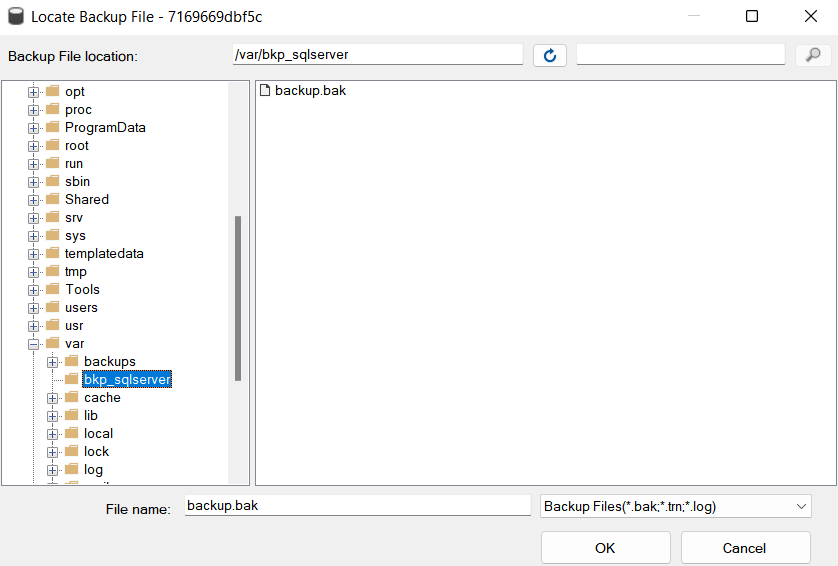

# Executando o SQL Server em um Container Docker
Este tutorial tem por objetivo demonstrar a instalação e uso do SQL Server a partir de containers Docker, uma prática que pode ser bastante útil na montagem de ambientes para desenvolvimento em .NET (ou até mesmo outras plataformas). 

### Para implementar o ambiente apresentado neste tutorial foram utilizados como recursos:  
#### [Docker for Windows](https://www.docker.com/docker-windows/)
#### Windows PowerShell.  

### Documentações consultadas:  

#### [Executar imagens de contêiner do SQL Server Linux com o Docker](https://hub.docker.com/_/microsoft-mssql-server)
#### [Microsoft SQL Server](https://hub.docker.com/_/microsoft-mssql-server)

## Passo 1: Baixando Docker  Windows.

O [Docker for Windows](https://www.docker.com/docker-windows/), que permitirá a criação de imagens e containers para testes em máquinas de desenvolvimento baseadas no Windows

Exemplo de arquivo de instalação: “Docker_Desktop_Installer.exe”

## Passo 2: Criação de um container baseado na imagem do SQL Server.

Abra um terminal de comandos e digite os comandos abaixo:

|docker run --name sqlserver2022 -e 'ACCEPT_EULA=Y' -e 'SA_PASSWORD=8F*J@9'  -e 'TZ=America/Sao_Paulo' -p 1433:1433 -v C:\bkp_sqlserver\:/var/bkp_sqlserver/ -d mcr.microsoft.com/mssql/server:2022-latest| 
| :--- | 

 
| Variáveis                  |                                                                                                         |
| :---                       | :---                                                                                                    |
| docker run                 | Cria e executa o container Docker.                                                                      |
| --name=sqlserver2022       | Especifica o nome do container a ser gerado.                                                            |
| -e 'ACCEPT_EULA=Y'         | Aceita os termos de licença da Microsoft.                                                               |
| -e 'SA_PASSWORD=qj8F*J@9'  | Foi indicada a senha do administrador usuário SA.                                                       |
| -e 'TZ=America/Sao_Paulo'  | TimeZone (Fuso Horário Brasil) da imagem docker.                                                        |
| -p 1433:1433               | Mapeia a porta 1433 do contêiner para porta 1433 do host.                                               |
| -d                         | Mapeia a porta 1433 do contêiner para porta 1433 do host.                                               |
| -v                         | Mapeamento de volume.                                                                                   |
| mcr.microsoft.com/mssql/server:2019-latest  mcr.microsoft.com/mssql/server:2022-latest | Nome da imagem usada para criar o contêiner.|

## Passo 3: Backup banco de dados.

Adicione seu arquivo de backup "backup.bak" na pasta do seu windows "C:\bkp_sqlserver" conforme criado no passo 2 "-v C:\bkp_sqlserver\:/var/bkp_sqlserver/"

## Passo 3.1: Conexão via SQL Server Management Studio.

Para a conexão via SQL Server Management Studio informar em Server name o servidor (neste caso localhost), além das credenciais de acesso nos campos Login e Password:

## Passo 3.2 Restaurando banco de dados (RESTORE).

01) Clique com o botão direito em “Database” e selecione a opção “Restore Database”.

02) A janela “Restore Database” será exibida. Nela, marque a opção “Device” e clique no botão “…” para fazer a busca do arquivo de Backup Banco de dados que será utilizado para restaurar.

03) Nesta janela selecione se o banco de dados a ser restaurado é um arquivo de Backup, em seguida, clique em “Add” e selecione o arquivo.

04) Selecione o arquivo de Backup e clique em “Ok”.

05) Ao término deste procedimento, o caminho do seu Backup estará destacado, e por fim, clique em Ok.

